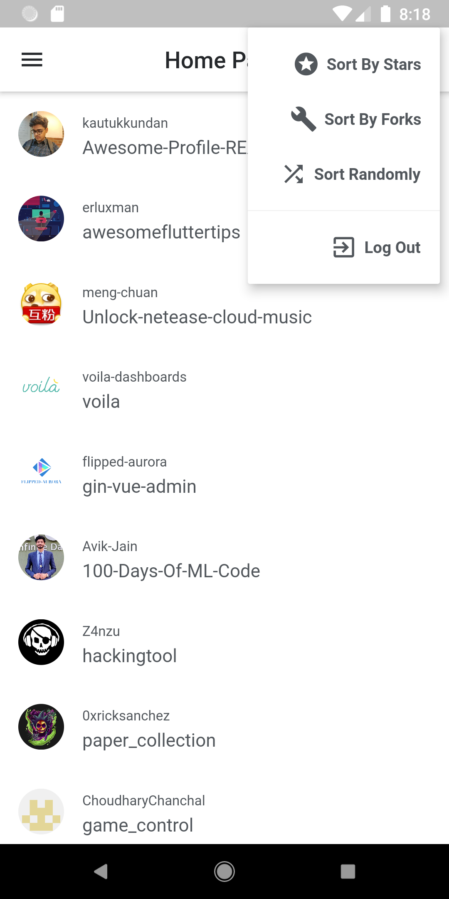

# Flutter Sample Application Exploration 

## Features:
- Bloc Architecture (includes bloc testing)
- Dependency Injection
- Static Code Analysis
- Form Validation
- Drag-And-Drop
- List Re-Ordering
- Swipe to Dismiss
- SharedPreferences
- Repository 

- And More...

## Packages in this App:
- Flutter Bloc 
- RxDart 
- Get It 
- Secure Storage 
- Json Serializer 
- Equatable 
- Pedantic 
- And More...

## Screenshots

|  |  |   | |
| :---:                              | :---:                             | :---:                              | :---:     |
| | | | |
| | | | |
| |